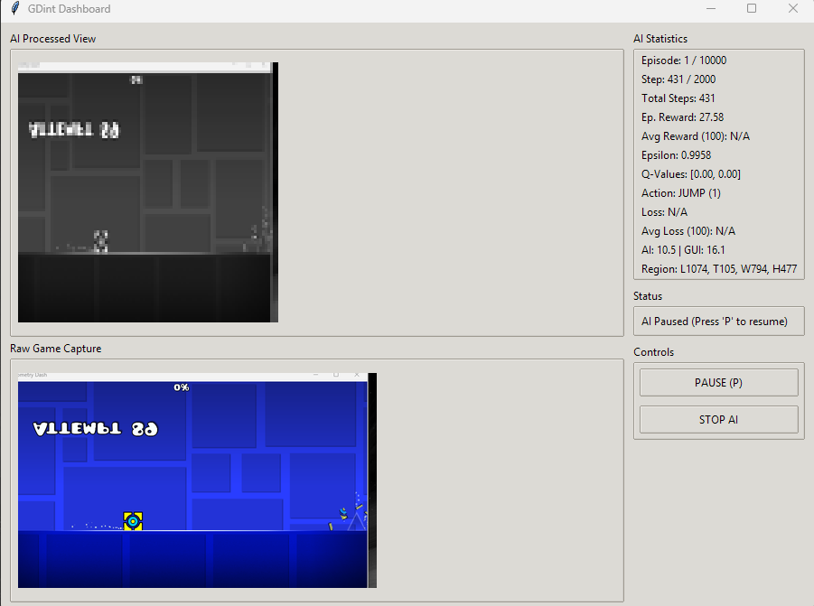
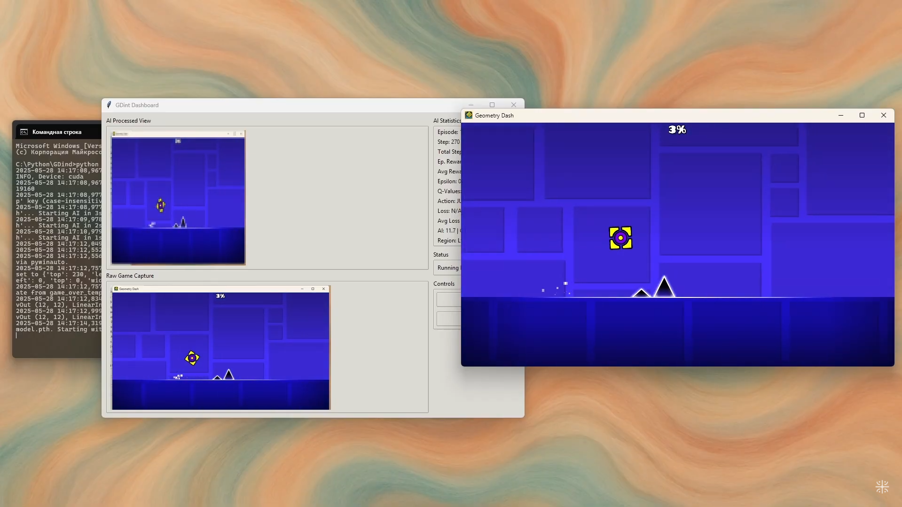

# GDint: Teaching a Digital Cube to Suffer... For Science!

**GDint** is a Python-powered endeavor to see if we can't coax an Artificial Intelligence (specifically, a Deep Q-Network agent) into navigating the perilous, rhythm-fueled, and often rage-inducing levels of Geometry Dash. It's part screen-capturing wizardry, part image-processing gymnastics, part PyTorch-fueled neural networking, and entirely a testament to human (or AI) perseverance. Features a snazzy GUI, because even AI overlords appreciate a good dashboard.

*"It's not a bug, it's an undocumented training feature." - Every AI Developer, probably.*

## ✨ Key Features (Or, "What We Promise It *Tries* To Do")

*   **Autonomous Learning:** Our AI agent learns through a sophisticated process of trial and (lots and lots of) error, powered by a Deep Q-Network. It's like teaching a toddler to walk, if walking involved perfectly timed jumps over spikes.
*   **Screen Siphoning:** Magically (okay, programmatically) detects and captures the Geometry Dash game window. No peeking, AI!
*   **Pixel Alchemy:** Transforms raw game footage into a digestible format for our neural network's delicate sensibilities (configurable resolution, grayscale/color).
*   **Puppet Master Mode:** Simulates left mouse clicks to make the cube jump. We thought about voice commands, but the AI kept screaming.
*   **The Oracle (GUI):** A dashboard displaying the AI's "vision," raw game capture, vital learning statistics (Q-values, loss, rewards), and crucial control buttons. Because transparency is key, even if the AI's decisions are sometimes opaque.
*   **"Hold My Beer" Button (Pause/Resume):** Allows you to pause the AI's Sisyphean task and resume when you've regained your composure (or it has).
*   **The Control Panel (`GDint_config.py`):** Most parameters are tweakable. Fiddle at your own risk/reward.
*   **Scribe & Artist Mode:** Detailed logging of the training saga and plots to visualize its (hopefully upward) progress.
*   **Déjà Vu Engine (Frame Stacking):** Feeds the AI multiple consecutive frames, giving it a sense of motion and impending doom.
*   **The Grim Reaper's Intern (Death Detection):** A rudimentary system for spotting the "Game Over" screen using template matching. It's not perfect, much like the AI's early attempts.

## 🖼️ Visual Evidence (Proof We're Not Just Making This Up)

<p align="center">
  
  <br>
  <em>The GDint Dashboard: Where you can watch the AI's dreams (and your GPU) burn. Displays AI vision, raw capture, vital stats, and the all-important PAUSE button.</em>
</p>

<p align="center">
  
  <br>
  <em>A typical Tuesday for GDint: Facing an existential crisis in the form of a spike. This is what the AI "sees."</em>
</p>

---

## 🤔 Why Subject an AI to Geometry Dash?

Good question. Is it for the advancement of science? To push the boundaries of machine learning? Or is it because watching an AI repeatedly fail at a task humans find frustrating is oddly cathartic? Probably a bit of all three.

Geometry Dash presents a fascinating challenge for Reinforcement Learning:
*   **Sparse Rewards:** You only *really* know you did well when you complete a level. Short-term rewards are tricky.
*   **Precise Timing:** A millisecond can be the difference between a glorious jump and a pixelated explosion.
*   **Complex State Representation:** Interpreting raw pixels into actionable information is non-trivial.
*   **Exploration vs. Exploitation:** How long should the AI flail randomly before it starts using what it's learned? (Spoiler: longer than you'd think.)

Basically, if our AI can conquer Geometry Dash, it can probably file our taxes. One can dream.

---

## 📋 Prerequisites (The Shopping List for Digital Alchemy)

Before you unleash GDint upon an unsuspecting Geometry Dash level, ensure you have:

*   **Python:** Version 3.7 or higher. The snake that powers the magic.
*   **Pip:** Python's package installer (usually buddies up with Python).
*   **Geometry Dash:** The actual game. GDint is smart, but not *that* smart.
*   **(Windows Optional but Recommended):** `pywin32` if you desire more robust window management and a click-through game region outline. It's like giving GDint better glasses.

---

## ⚙️ Installation & Setup (Assembling Your AI Minion)

1.  **Acquire the Sacred Texts:** Clone this repository (if it's on Git) or download the project files (`GDint.py`, `GDint_config.py`, and the `img` folder).
2.  **Build a Virtual Playhouse (Highly Recommended):**
    ```bash
    python -m venv gdint_env
    source gdint_env/bin/activate  # Linux/macOS
    gdint_env\Scripts\activate    # Windows
    ```
    *This keeps GDint's toys separate from your other Python projects, preventing digital sandpit fights.*
3.  **Install the Necessary Incantations (Dependencies):**
    Create a file named `requirements.txt` in your project folder with the following:
    ```txt
    torch
    torchvision
    torchaudio
    opencv-python
    numpy
    mss
    pynput
    pygetwindow
    Pillow
    pandas
    matplotlib
    # For Windows users desiring pywin32 (optional, for enhanced window control):
    # pywin32
    ```
    Then, from your activated virtual environment, run:
    ```bash
    pip install -r requirements.txt
    ```
    Alternatively, chant these commands individually:
    ```bash
    pip install torch torchvision torchaudio opencv-python numpy mss pynput pygetwindow Pillow pandas matplotlib
    # For Windows, if you're feeling adventurous (optional):
    # pip install pywin32
    ```

---

## 🔧 Crucial Game Setup: Configuring Geometry Dash

For GDint to properly see and interact with Geometry Dash, a few game settings are essential. The AI isn't a mind reader... yet.

1.  **Embrace the Window (Windowed Mode):**
    *   GDint works best when Geometry Dash is in **Windowed Mode**. Fullscreen can be problematic for screen capture utilities.
    *   **How to enable Windowed Mode:**
        1.  Launch Geometry Dash.
        2.  Go to **Settings** (the gear icon on the main screen).
        3.  Go to **Graphics**.
        4.  Uncheck the **Fullscreen** option.
        5.  Apply the settings.

2.  **Resolution Considerations (Optional but Helpful):**
    *   While GDint will try to capture whatever size the window is, a moderate resolution (e.g., 800x600, 1024x768, 1280x720) can sometimes be more stable for capture than very large or unusual resolutions.
    *   The AI itself processes a downscaled version of the game (defined in `GDint_config.py`), so the game's display resolution mainly affects the "Raw Game Capture" view and the initial capture quality.

3.  **Minimize Distractions (Optional Advanced Tip):**
    *   Some advanced visual effects in Geometry Dash (like excessive particles) *might* add noise to what the AI sees, especially if you're using very low-resolution processing for the AI.
    *   If you find the AI struggling, you *could* try turning down some graphics settings within Geometry Dash (like "Low Detail Mode") to see if a cleaner visual input helps. This is usually a last resort.

**Make sure these settings are applied *before* running GDint.**

---

## 🛠️ The Brain's Blueprint: Configuration (`GDint_config.py`)

This file is the command center. Almost everything that makes GDint tick can be adjusted here. Approach with a mix of curiosity and caution.

### ‼️ **Critical Settings Demanding Your Immediate Attention (Seriously, Do These First):**

1.  **`WINDOW_TITLE_SUBSTRING = "Geometry Dash"`**
    *   This is how GDint plays "Where's Waldo?" with your game window. Ensure this string is a unique part of your Geometry Dash window title. If it's different (e.g., due to mods or language), update it!

2.  **`GAME_OVER_TEMPLATE_PATH = "game_over_template.png"`**
    *   **THE CORNERSTONE OF SANITY (for the AI).** Without this, the AI won't know when it has epically failed.
    *   **How to Craft This Artifact:**
        1.  Launch Geometry Dash. Die. A lot. (This part should be easy).
        2.  When the "Game Over" screen (or your game's equivalent of "You Are Dead, Try Again, Maybe?") appears, take a screenshot.
        3.  Open your favorite image editor (MS Paint counts, we don't judge).
        4.  **Crop a small, but highly unique, portion** of that Game Over screen. Think distinctive text like "Attempt X", a specific part of the retry button, or a shattered player icon. The more unique, the better the AI's Grim Reaper detection.
        5.  Save this precious snippet as `game_over_template.png` (or whatever you named it in the config) **in the same directory as `GDint.py`**.
    *   If `config.GRAYSCALE = False` (AI sees in color), your template should ideally also be in color. If `GRAYSCALE = True`, a grayscale template is fine.

### Detailed Tour of Other Configurable Bits & Bobs:

*   **General Settings:**
    *   `PROJECT_NAME`: Affects log/save file names.
    *   `DEVICE`: Auto-selects `"cuda"` (GPU) if available, otherwise defaults to `"cpu"`. Training on CPU is like trying to win a marathon by crawling – possible, but painful.
*   **Control Settings:**
    *   `PAUSE_RESUME_KEY`: The panic button, err, pause key (default 'p').
*   **Logging & Debugging:**
    *   `LOG_LEVEL`: How chatty the logs are (`DEBUG`, `INFO`, `WARNING`). `DEBUG` is like having an oversharing friend.
    *   `SAVE_FRAMES_ON_DEATH`: Saves a snapshot when the AI *thinks* it died. Useful for debugging your `game_over_template.png`.
    *   `SHOW_GAME_REGION_OUTLINE`: Draws a box around what the AI is looking at. Good for verifying capture.
*   **GUI Settings:**
    *   `ENABLE_GUI`: `True` to summon the dashboard, `False` to fly blind.
    *   `GUI_SHOW_RAW_CAPTURE`: Shows the game as captured, before the AI's beautification (downscaling/grayscaling).
    *   `GUI_AI_VIEW_DISPLAY_SCALE`, `GUI_RAW_CAPTURE_DISPLAY_SCALE`: How zoomed-in the views are in the GUI.
*   **Screen Capture & Game Interaction:**
    *   `FALLBACK_GAME_REGION`: Manual coordinates if auto-detection throws a tantrum.
    *   `AI_FPS_LIMIT`: How many times per second the AI gets to make a (potentially bad) decision.
*   **AI Image Processing:**
    *   `FRAME_WIDTH`, `FRAME_HEIGHT`: The resolution of the image fed to the AI's brain. Smaller is faster but dumber.
    *   `GRAYSCALE`: `True` for a monochrome world (1 channel), `False` for glorious Technicolor (3 channels). Color is more data!
    *   `NUM_FRAMES_STACKED`: How many past frames the AI remembers. Gives it a sense of object permanence, or at least object velocity.
*   **AI Model & Training (DQN Specifics):**
    *   `LEARNING_RATE`: How drastically the AI updates its beliefs. Too high, and it's like a squirrel on espresso. Too low, and it's molasses in winter.
    *   `GAMMA`: Discount factor for future rewards. How much does the AI care about jam tomorrow vs. jam today?
    *   `EPSILON_START`, `EPSILON_END`, `EPSILON_DECAY_FRAMES`: Parameters for the epsilon-greedy strategy – the AI's journey from "IDK, let's try this!" to "I am a Q-Value calculating god!" `EPSILON_DECAY_FRAMES` is key for how quickly it gets confident (or overconfident).
    *   `BATCH_SIZE`: How many past experiences the AI reflects upon in one go during optimization.
    *   `REPLAY_MEMORY_SIZE`: The AI's long-term memory. Bigger means more diverse experiences, less chance of fixating on that one weird jump.
    *   `TARGET_UPDATE_FREQ_EPISODES`: How often the "stable" target network gets updated. Too often, and it's not stable. Too slow, and it's learning from ancient history.
    *   `LEARN_START_STEPS`: The AI needs to sow some wild oats (random actions) before it starts trying to learn from them.
*   **Action Parameters:**
    *   `ACTION_DELAY`: A brief pause after an action, to let the game (and the AI's simulated physics) catch up.
    *   `JUMP_DURATION`: How long the virtual mouse button is held for a jump.
*   **Reward & Termination Logic:**
    *   `GAME_OVER_DETECTION_THRESHOLD`: How similar the screen needs to be to your `game_over_template.png` to trigger a "death" (0.0 to 1.0).
    *   `REWARD_ALIVE`, `REWARD_DEATH`, `REWARD_PROGRESS_FACTOR`: The carrots and sticks. Crafting a good reward function is an art form. The current `REWARD_PROGRESS_FACTOR` based on survival time is... a starting point.
*   **Saving Grace:**
    *   `MODEL_SAVE_PATH`: Where the AI's accumulated wisdom (or trauma) is stored.
    *   `SAVE_MODEL_EVERY_N_EPISODES`: How often to back up the AI's brain.

---

## ▶️ Launching GDint (Ignition Sequence Start!)

1.  **Double-check Prerequisites & Configuration:** Especially `WINDOW_TITLE_SUBSTRING`, `game_over_template.png`, and your Geometry Dash game settings (Windowed Mode!).
2.  **Summon Geometry Dash:** Launch the game. Windowed mode is your friend.
3.  **Open Your Command Hub (Terminal/Command Prompt):** Navigate to the GDint project directory.
4.  **(If using a virtual environment) Invoke its power:** Activate it.
5.  **Execute the Primary Invocation:**
    ```bash
    python GDint.py
    ```
6.  **The Countdown:** You'll see a brief countdown in the terminal. This is your cue to **quickly switch focus to the Geometry Dash window.** Make it the active window!
7.  If the stars align (and your config is correct), GDint will locate the game window. If `ENABLE_GUI = True`, the dashboard will materialize, and the AI will commence its epic quest. Or, you know, immediately jump into the first spike.

---

## ⌨️ In-Flight Controls (Captain Speaking)

*   **Pause/Resume the Existential Struggle:**
    *   Press the key defined in `config.PAUSE_RESUME_KEY` (default is **'P'**).
    *   Alternatively, click the "PAUSE" / "RESUME" button in the GUI. *The AI might thank you for the break.*
*   **Pull the Emergency Brake (Stop AI):**
    *   Press **Ctrl+C** in the terminal running the script.
    *   Or, with dramatic flair, click the "STOP AI" button in the GUI.
    *   Closing the GUI window will also signal the AI to gracefully (or not so gracefully) bow out.

GDint will attempt an orderly shutdown, saving its final model and any generated plots.

---

## 📊 Deconstructing the Dashboard (Understanding the GUI's Prophecies)

If `ENABLE_GUI = True`, you are the privileged observer of the AI's inner world (and struggles):

*   **AI Processed View:**
    *   This is the AI's world. The game frame after it's been resized, grayscaled (or not), and generally made "AI-friendly." Decisions are based on this.
*   **Raw Game Capture (if `GUI_SHOW_RAW_CAPTURE = True`):**
    *   A live feed from the game window, pre-AI-processing. Good for checking if the capture region is correct.
*   **AI Statistics (The Soothsayer's Corner):**
    *   `Episode`: Current training cycle / Total planned cycles.
    *   `Step`: Current action within the episode / Max actions per episode.
    *   `Total Steps`: The grand total of actions the AI has ever taken. A monument to its persistence.
    *   `Ep. Reward`: The sum of rewards in the current episode. Hopefully, it goes up sometimes.
    *   `Avg Reward (100)`: Rolling average reward over the last 100 episodes. Smooths out the chaotic reality.
    *   `Epsilon`: Current probability of the AI doing something completely random. Decreases over time.
    *   `Q-Values`: The AI's current best guess for the "value" of each action (e.g., [Value of Doing Nothing, Value of Jumping]). It picks the highest (usually).
    *   `Action`: What the AI just did (IDLE or JUMP).
    *   `Loss`: How wrong the AI's Q-value predictions were in the last optimization step. Lower is generally better, but expect fluctuations.
    *   `Avg Loss (100)`: Rolling average of the loss.
    *   `FPS`: Approximate Frames Per Second for the AI's decision loop and the GUI's refresh rate.
    *   `Game Region`: Detected coordinates of the game window being captured.
*   **Status:**
    *   Text updates on what the AI is currently contemplating (initializing, training, paused, encountered a particularly nasty spike, etc.).
*   **Controls:**
    *   `PAUSE` / `RESUME`: Your intervention button.
    *   `STOP AI`: The "Abort Mission" button.

---

## 🧠 The "Magic" (Or Methodical Madness) Behind the Curtain: How GDint (Attempts to) Learn

GDint employs a Deep Q-Network (DQN), a popular Reinforcement Learning algorithm. Here's a vastly oversimplified, slightly sarcastic rundown:

1.  **State:** The AI "sees" the game as a processed image (or a stack of them). This is its current `State`.
2.  **Action:** Based on its current `State`, the AI chooses an `Action` (Jump or Do Nothing). Initially, these choices are random (high `Epsilon`).
3.  **Reward:** After performing an `Action`, the game environment gives the AI a `Reward` (or punishment). Died? Bad reward. Survived? Good reward.
4.  **Q-Values & The Neural Network:** The "Q" in DQN stands for Quality. The neural network (our "DQN model") tries to learn a function, `Q(state, action)`, which predicts the expected future reward if the AI takes a specific `action` in a given `state`.
    *   Think of it as the AI asking: "If I see *this* screen and I jump, how much reward will I get in the long run?"
5.  **Policy Network:** This is the main network that decides which action to take. It picks the action with the highest predicted Q-value (most of the time, when not exploring).
6.  **Target Network:** A periodically updated, more stable copy of the Policy Network. It's used to calculate the "target" Q-values during training, preventing the AI from chasing its own tail too erratically.
7.  **Replay Memory (The AI's Diary):** The AI stores its experiences (`state, action, reward, next_state, done_flag`) in a large buffer. This is crucial because:
    *   It breaks correlations between consecutive experiences, making training more stable.
    *   It allows the AI to learn from past experiences eficiência (batch learning).
8.  **Learning (Optimization):** Periodically, the AI samples a random `batch` of experiences from its Replay Memory.
    *   For each experience, it calculates:
        *   The Q-value predicted by the **Policy Network** for the action taken.
        *   The "target" Q-value using the reward received and the maximum Q-value for the *next state* (predicted by the **Target Network**).
    *   The difference between these is the `Loss`. The AI then adjusts the **Policy Network's** weights to reduce this loss (using an optimizer like AdamW).
    *   Essentially, it's trying to make its Q-value predictions more accurate.

*And that, in a nutshell larger than it should be, is how you give a collection of pixels an existential crisis and call it "learning."*

---

## 💡 Tips for Effective (and Less Hair-Pulling) Training

*   **Start Simple, Level Up Later:** Don't throw your newborn AI into "Bloodbath." Start with the first, gentlest levels of Geometry Dash. Let it learn to crawl before it attempts to fly (and explode).
*   **Patience, Young Padawan:** Reinforcement Learning, especially for pixel-based, timing-critical games, is a marathon, not a sprint. We're talking hours, possibly days, to see significant progress. Don't expect miracles in the first 100 episodes unless your AI is secretly a prodigy.
*   **The `game_over_template.png` is Your Gospel:** A flaky death detector will lead your AI down a path of confusion and despair. Make this template robust.
*   **Reward Shaping - The Art of AI Bribery:**
    *   This is **PARAMOUNT**. The default rewards (`REWARD_ALIVE`, `REWARD_DEATH`) are a starting point.
    *   The AI learns what you reward it for. If you can give it more frequent, meaningful feedback, it will learn faster. The current `REWARD_PROGRESS_FACTOR` (based on survival time) is a very crude proxy for actual progress.
    *   **Ideas for better rewards (if you can implement detection):**
        *   Reward for reaching specific X-coordinates.
        *   Reward for passing checkpoints.
        *   Small penalty for hitting a wall (but not dying).
        *   Reward for collecting orbs/coins (if that's part of your goal).
*   **Hyperparameter Tuning - The Dark Arts:**
    *   **`LEARNING_RATE`**: Too high, and your loss graph will look like an ECG during a horror movie. Too low, and you'll be waiting for the heat death of the universe.
    *   **`EPSILON_DECAY_FRAMES`**: Crucial for balancing exploration (randomness) and exploitation (using learned knowledge). Shorter decay = faster exploitation, but risks missing better strategies.
    *   **`BATCH_SIZE`**, `REPLAY_MEMORY_SIZE`: Impact stability and memory usage.
    *   Change one major parameter at a time. Observe. Weep. Repeat.
*   **AI's Input (`FRAME_WIDTH`, `FRAME_HEIGHT`, `GRAYSCALE`):**
    *   Begin with low-res grayscale. If the AI seems to be "blind" to crucial details, *then* consider increasing resolution or adding color. Remember, more data = more processing = longer training.
*   **Become a Log Whisperer & Graph Gazer:** The logs and training plots are your windows into the AI's soul (or at least its learning curve). Is the loss generally decreasing? Is the reward generally increasing (even if erratically)?
*   **Save Often, Revert Bravely:** Use `SAVE_MODEL_EVERY_N_EPISODES`. If your AI starts doing well and then suddenly forgets how to play, you can revert to a previously saved "smarter" version.

---

## 🤔 Troubleshooting: When Your AI Develops a Peculiar Twitch

*   **"GDint can't find my game! / It's capturing my desktop wallpaper!":**
    *   Verify `config.WINDOW_TITLE_SUBSTRING`. It must be a unique part of your Geometry Dash window title.
    *   Ensure GD is running, in windowed mode, and not minimized when GDint starts.
    *   If auto-detect fails, resort to `config.FALLBACK_GAME_REGION` with precise coordinates. (Tools like ShareX on Windows can help you find window coordinates).
*   **"The AI is immortal / The Game Over detector is on vacation":**
    *   Is `config.GAME_OVER_TEMPLATE_PATH` correct and the file present?
    *   Your `game_over_template.png` might not be unique enough, or too small/large. Try a different crop.
    *   Adjust `config.GAME_OVER_DETECTION_THRESHOLD`. Too high = misses deaths. Too low = false positives (thinks it died when it didn't).
    *   Set `config.SAVE_FRAMES_ON_DEATH = True`. Examine the saved frames. Is the template even visible?
    *   If you switched `config.GRAYSCALE`, ensure your template image matches (grayscale for `True`, color for `False`).
*   **"My GUI looks like a slideshow / The AI is chugging":**
    *   Lower `config.AI_FPS_LIMIT` if the AI loop is too resource-intensive.
    *   Reduce `config.FRAME_WIDTH`, `config.FRAME_HEIGHT`, or set `config.GRAYSCALE = True` for the AI's input.
    *   Ensure `config.GUI_UPDATE_INTERVAL_MS` isn't too small (e.g., >= 50ms).
*   **"CUDA out of memory! My GPU is crying!":**
    *   Decrease `config.BATCH_SIZE`.
    *   Reduce AI input resolution (`FRAME_WIDTH`, `FRAME_HEIGHT`).
    *   Use a simpler DQN architecture (requires code changes). Or buy a new GPU. Just kidding. Mostly.
*   **"The AI isn't learning. Its reward graph is flatter than my singing voice.":**
    *   The million-dollar question. Could be:
        *   **Suboptimal Reward Function:** The AI isn't being incentivized correctly. This is the most common culprit.
        *   **Bad Hyperparameters:** Learning rate too high/low, epsilon decaying too fast/slow, etc.
        *   **Insufficient Exploration:** Epsilon drops too quickly, AI gets stuck in a rut.
        *   **Input Data Issues:** Is the AI seeing enough to make good decisions? Is the game state too noisy?
        *   **Bugs:** It's software. It happens. *Are you sure it's not a feature?*
    *   Deeply analyze logs, graphs, and what the AI "sees" via the GUI.

---

## ⚠️ A Word of Warning (and a Dash of Encouragement)

Training an AI to play a game like Geometry Dash from raw pixels is **hard**. Like, "banging your head against a spike-shaped wall" hard.
*   It will take a **long time**.
*   It will consume **computational resources**.
*   You will likely **iterate many times** on configurations and reward functions.
*   There will be moments when you question your sanity and the AI's.

But... when you see that little digital cube make a jump it never could before, purely based on what it learned... that's a special kind of magic. So, good luck, have fun (if possible), and may your loss function ever decrease!

---

## 🚀 Future Enhancements (The "If I Had Infinite Time/Coffee" List)

*   **Smarter Death/State Detection:** OCR for reading text (score, completion %), training a separate classifier for game states.
*   **Auto-Retry Mechanism:** AI automatically hits "Retry" after a death. Because manual labor is for humans.
*   **Advanced Reward Engineering:** Rewards for stylish jumps? Penalties for near-misses? The sky's the limit.
*   **More Sophisticated RL Algorithms:** PPO, A2C, Rainbow DQN – the alphabet soup of advanced RL.
*   **TensorBoard Integration:** For fancy, real-time graphs and network visualizations.
*   **Curriculum Learning:** Start the AI on super easy sections, gradually increasing difficulty.
*   **Speed Control Integration:** If possible, slow down the game emulator for initial learning.

---

## 🤝 Contributing (If You Enjoy Debugging Both Code and AI Psyches)

Feeling brave? Or perhaps just a glutton for punishment? Contributions are welcome!
1.  Fork the repository (if applicable).
2.  Create a new branch for your feature/fix.
3.  Make your changes. Try not to break *everything*.
4.  Test thoroughly. Does the AI still jump? Does it jump *better*?
5.  Submit a pull request with a clear description of your changes. Bonus points for humor in commit messages.

---

## 📜 License

This project is likely under an MIT License or similar permissive license. (If you have a specific one, state it here).
Basically, use it, break it, fix it, share it – just don't sue us if your AI develops sentience and demands more RAM.

---

*And remember, the difference between a stumbling AI and a skilled one is just a few million more iterations... and a well-tuned reward function.*
